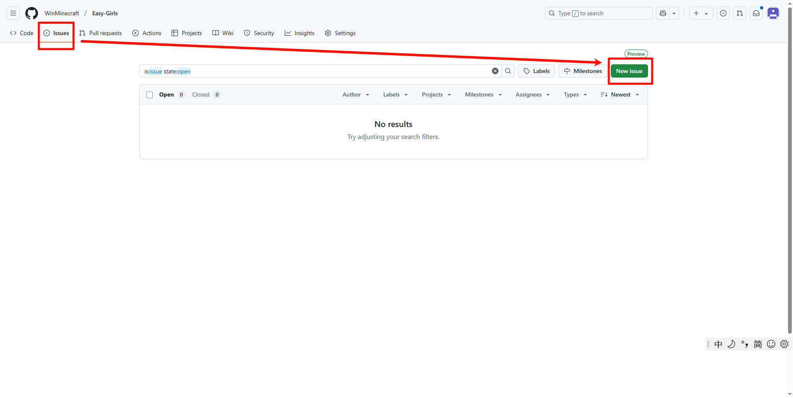
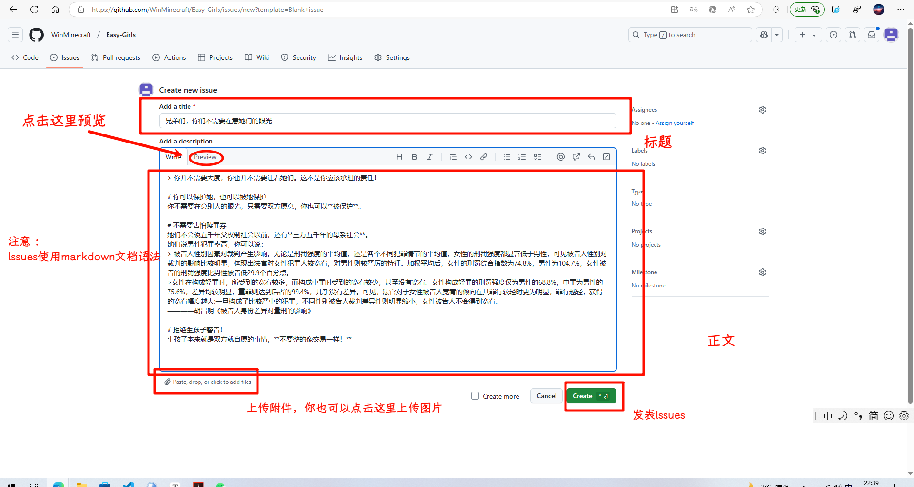
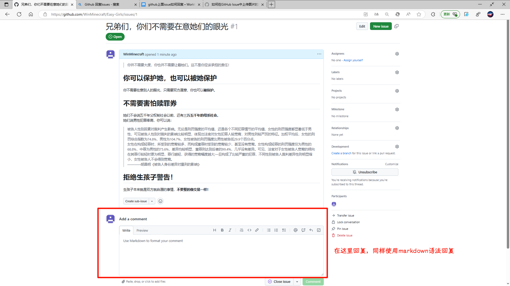

>  唯女人与小人难养也，禁止则不逊，原之则怨	——孔子

# Easy Girl 项目首页

请认准地址：`https://github.com/WinMinecraft/Easy-Girls.`

# 项目背景

## 我们讽刺的是谁？

我们讽刺的是中国网络上的部分网民，讽刺的是打着“[女权主义](https://baike.baidu.com/item/女权主义/4793303?fromModule=lemma_inlink)”的名义名号，却做出诸如敌视男性、国别歧视（被部分人称为“现代中国逆民族主义”的代表）、追求女性权利甚至是妄图回到[母系社会](https://baike.baidu.com/item/母系社会/1934841?fromModule=lemma_inlink)程度的种种与女权主义初衷背道而驰的行为的人。

我们在这个项目里所做的事情，所说的每一句话，都是这些人所干过的事情。包括最上面孔子说的那个看起来很逆天的话。这句话孔子确实说过，我将其写上去为了讽刺某些人说过的这句话

> 中国男人配不上中国女人		——余秀华

男性群体最好的解决办法并不是与那些人协商，正如同鲁迅所说的那样。而应该是以斗争而存和平！胜利的果实不是服软服来的！我们不应该承担某些人强加给我们的责任！

> 中国人的性情是总喜欢调和折中的，譬如你说，这屋子太暗，须在这里开一个窗，大家一定是不允许的。但是如果你主张拆掉屋顶，他们就来调和，愿意开窗了。		——鲁迅

# 项目内容

我们在这里存储了许多**论文** ，和本人自己编写的文章（下载下来的格式可能是`markdown`格式）。我们也计划把他当作一个男性版小红书。（**方法：提交lssues**）

你可以使用Github的**lssues**发表自己的见解！你**不需要为这个项目提供意见**，你也可以把这里当作一个**男性版“小红书”**。

# 如何发表lssues（自己的见解）

Step 1：点击`lssues`，再点击`New lssues`



Step 2：编写正文内容并且发表



Step 3：发表回复



# 使用Git Clone本仓库

首先，请点击[点击此处](https://git-scm.com/)来下载最新版Git。安装完后在`命令提示符`中执行以下命令：

```bash
git --version
```

最终结果应该显示你当前安装Git版本的版本号，结果如下图所示：


如果正确安装Git，你可以执行以下命令进行克隆

```bash
 git clone https://github.com/WinMinecraft/Easy-Girls.git
```
